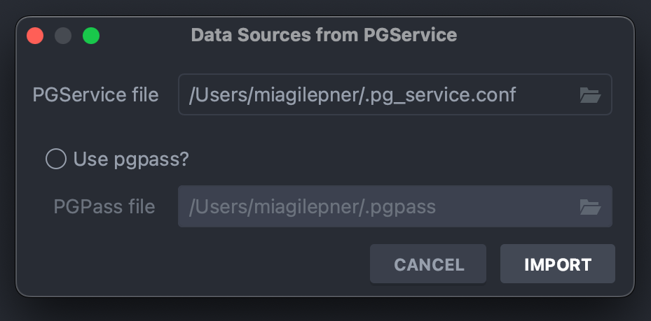
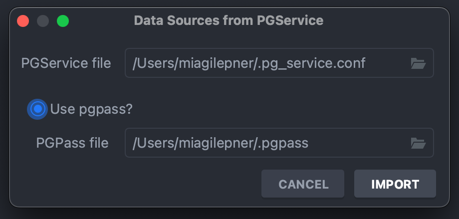

# pgservice-jetbrains-plugin

<!-- Plugin description -->
Import PostgreSQL databases from pg_services.conf. Supports:
- overwriting existing datasources
- using credentials from pgpass

Existing datasources are overwritten based on the service name - the service name must match the name of the datasource.

The service must be present in the pgservices file to be imported.  
<!-- Plugin description end -->

## Installation

- Using IDE built-in plugin system:
  
  <kbd>Settings/Preferences</kbd> > <kbd>Plugins</kbd> > <kbd>Marketplace</kbd> > <kbd>Search for "pgservice-jetbrains-plugin"</kbd> >
  <kbd>Install Plugin</kbd>
  
- Manually:

  Download the [latest release](https://github.com/miagilepner/pgservice-jetbrains-plugin/releases/latest) and install it manually using
  <kbd>Settings/Preferences</kbd> > <kbd>Plugins</kbd> > <kbd>⚙️</kbd> > <kbd>Install plugin from disk...</kbd>
